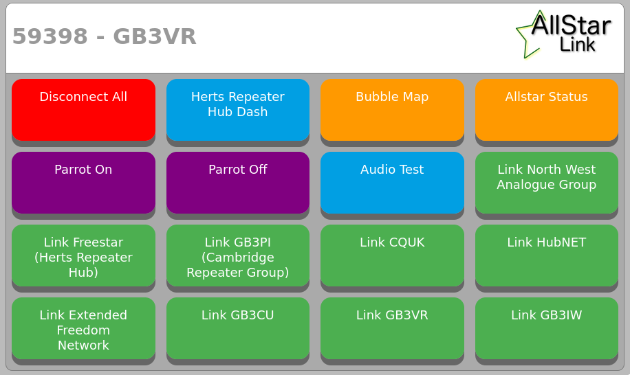

# Herts Repeater Group Node Control Panel
This is a simple control panel used by a number of [Allstar](https://www.allstarlink.org) nodes in the [Herts Repeater Group](https://hertsrepeaters.com/) network.

The original idea was implemented by G7RPG. Later, G7HMV and G4IYT used a modified version for several of the HRG boxes. This version was rewritten from scratch by G4IYT to make it easier to configure as it was deployed to new nodes, and is now in use across a number of nodes in the Herts Repeater Group network.



## Installation
Any existing Allstarlink installation that uses Allmon or Supermon should have everything required to use this control panel. Simply put the files from the `src/` folder inside either the root or a subfolder of:

- `/var/www/html` for ASL 2 or 3
- `/srv/http` for HamVOIP

HRG has nodes using this control panel that ASL2, ASL3, as well as HamVOIP, so it should work with whatever version you have.

Install the following packages:

```
sudo apt-get install -y apache2 libapache2-mod-php
```

Add this line to `/etc/sudoers` to allow the web server to call the asterisk manager command without requiring a password (try `sudo nano /etc/sudoers` from SSH):

```
www-data ALL=(ALL) NOPASSWD: /usr/sbin/asterisk
```

## Security
We use a simple `.htaccess` to authenticate users with a simple username and password (easily found if you know what you are looking for), mainly to prevent random drive-by users and bots from clicking the buttons:

`.htaccess`:

```
<Files "index.php">
AuthName "GB3VR"
AuthType Basic
AuthUserFile /var/www/html/.htpasswd
require valid-user
</Files>
```

The `.htpasswd` file is created with the `htpasswd` command, e.g. `htpasswd -c .htpasswd gb3bp`.

## Configuration

`config.ini` sets up node information, e.g.:

```
[node]
number = 59398
title = GB3VR
```

`buttons.ini` then set up what the buttons do. Buttons are rendered in rows of 4, 3, 2, or even 1 depending on screen size. Buttons are output to the page in the order they are found in `buttons.ini`.

A button can either specify a set of DTMF commands:

```
[link_hrg]
title = "Link Freestar (Herts Repeater Hub)"
cmds[] = *52
color = green
```

`cmds[]` can have multiple values. For example it could be:

```
cmds[] = *73
cmds[] = *32167
```

This would run `*73` then `*32167` in turn.

Buttons can also be configured to open a URL:

```
[hrg_dash]
title = Herts Repeater Hub Dash
href = https://hub.hertsrepeaters.com
color = blue
```

URLs will open in a new tab by default.

## Help/Support/Feedback
This version was written and is maintained by G4IYT. 
